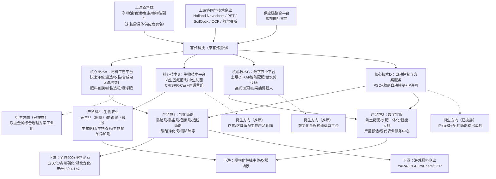
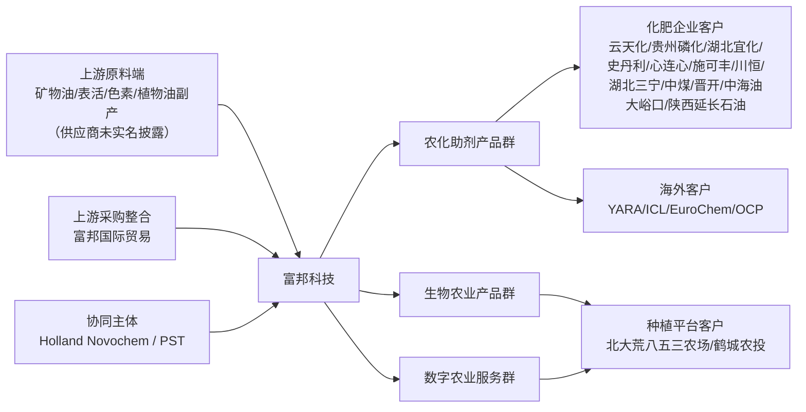

# 对话记录导出（逐字逐句版）

> 说明：本文件按时间顺序整理了本会话中“用户消息 + 助手正式答复（final）”的逐字内容。

---

## [1] 用户
`Tuesday, May 26, 2026, 1:15 PM (UTC)`  
富邦股份做个研究：1，这公司的上下游企业分别是谁？具体的名称。2，公司的核心技术是什么？这些核心技术可能衍生哪些其他技术和产品？画个关系图谱。

## [1] 助手
先说明口径：你说的“富邦股份”是深交所 `300387`，公司全称是湖北富邦科技股份有限公司，2025-01-02 证券简称由“富邦股份”变更为“富邦科技”。【F:/workspace/research/fubon_name_change.pdf†L7-L16】【F:/workspace/research/fubon_2025_h1_report.pdf†L152-L156】

## 1) 上下游企业分别是谁（具体名称）

### 上游（分两类看）
1. **原材料上游（公开披露到“品类”，未点名具体供应商）**  
   公司历史披露的核心原料是：矿物油、表面活性剂、色素、植物油副产品等；但公开材料未给出“前五大供应商实名”。【F:/workspace/research/fubon_ipo_2014_excerpt.pdf†L31-L40】【F:/workspace/research/fubon_2025_h1_report.pdf†L786-L790】

2. **可明确点名的上游协同/技术/供应链企业（公开披露名称）**  
   - `Holland Novochem B.V.`（荷兰诺唯凯）  
   - `PST INDUSTRIES`（法国 PST）  
   - `SoilOptix Inc.`  
   - `OCP S.A.`  
   - `阿尔赛斯（武汉）智能设备有限公司`  
   - `富邦（武汉）国际贸易有限公司`（集团采购整合平台）【F:/workspace/research/fubon_2025_h1_report.pdf†L71-L83】【F:/workspace/research/fubon_2025_h1_report.pdf†L787-L790】

> 注：这部分里既有外部协同方，也有公司体系内承担供应链/国际化布局的主体；如果你要“严格外部供应商名单”，公司公开报告目前并未完整实名披露。

---

### 下游（公开披露较明确）
公司明确写到其农化助剂业务覆盖全球 400+ 家肥料企业，典型客户包括：

- 国内：云天化、贵州磷化、湖北宜化、史丹利、心连心、施可丰化工、川恒股份、湖北三宁、中煤、晋开、中海油大峪口化工、陕西延长石油。  
- 海外：YARA、ICL、EuroChem、OCP。【F:/workspace/research/fubon_2025_h1_report.pdf†L317-L323】【F:/workspace/research/fubon_2025_h1_report.pdf†L781-L785】

---

## 2) 公司的核心技术是什么？可衍生哪些技术和产品？

### A. 核心技术（公司已披露）
1. **材料与工艺平台技术**：快速评价、材料遴选、材料改性、材料合成及添加控制、肥料包膜、砂性肥料造粒、悬浮肥生产等。  
   对应助剂产品：防结剂、防尘剂、多功能包裹剂、造粒改良剂、磷酸净化/除镉/除砷助剂等。【F:/workspace/research/fubon_2025_h1_report.pdf†L329-L358】【F:/workspace/research/fubon_2025_h1_report.pdf†L734-L739】

2. **生物技术平台**：禾本科固氮（内生固氮菌）、微生物线虫防治、生物菌剂；并结合 CRISPR-Cas、同源重组等技术。  
   对应产品：天生旦系列、前锋线系列、生物肥料、生物农药、生物食品添加剂。【F:/workspace/research/fubon_2025_h1_report.pdf†L552-L568】【F:/workspace/research/fubon_2025_h1_report.pdf†L102-L116】【F:/workspace/research/fubon_2025_h1_report.pdf†L776-L779】

3. **数字农业技术平台**：土壤检测+大数据+AI、智能配肥、茎水势传感精准灌溉、水肥一体化、智能大棚、高光谱产量预估、采摘机器人。  
   对应服务：从测土到配肥到种植管理的一体化“降本增产”方案。【F:/workspace/research/fubon_2025_h1_report.pdf†L597-L617】【F:/workspace/research/fubon_2025_h1_report.pdf†L796-L800】

4. **自动控制与方案化服务能力**：助剂自动控制系统、PSC 综合服务、IP/技术许可输出。【F:/workspace/research/fubon_2025_h1_report.pdf†L657-L659】【F:/workspace/research/fubon_2025_h1_report.pdf†L757-L759】【F:/workspace/research/fubon_2025_h1_report.pdf†L687-L691】

### B. 可衍生方向（“已在推进”+“合理推演”）
- **已在推进**：新型多功能包裹剂/造粒助剂、除重金属综合治理方案工业化、IP+专供设备+配套助剂的海外输出。【F:/workspace/research/fubon_2025_h1_report.pdf†L441-L443】【F:/workspace/research/fubon_2025_h1_report.pdf†L687-L691】  
- **合理推演**：区域/作物适配的固氮与线虫产品矩阵、数字农服的标准化运营平台（从单点产品到全流程服务）。

---

## 3) 关系图谱（产业链 + 技术 + 产品）

如果你愿意，我可以下一步给你做一版**“可投研使用”的表格版清单**（按“企业名称-关系类型-证据出处-确定性等级”四列输出），便于直接贴进报告。

---

## [2] 用户
`Tuesday, May 26, 2026, 1:19 PM (UTC)`  
Reminder to commit and push if appropriate.

## [2] 助手
已检查并处理：当前仓库在 `main` 分支、工作区已是干净状态（无待提交改动），所以这次**不需要** commit/push。  
我把刚才调研用的临时下载文件清理掉了，避免把原始 PDF 缓存误提交。

---

## [3] 用户
`Tuesday, May 26, 2026, 2:21 PM (UTC)`  
需要

## [3] 助手
好的，给你一版可直接放进投研笔记的结构化清单。

先确认主体：`富邦股份`即现`富邦科技`（300387），简称已于 2025-01-02 变更。【F:/workspace/research/fubon_name_change.pdf†L7-L16】【F:/workspace/research/fubon_2025_h1_report.pdf†L152-L156】

### 一、上下游企业清单（投研四列表）

> 确定性等级口径：  
> **高**=公司明确“合作关系/长期供应商/客户”  
> **中**=公司披露了企业名称与业务角色，但交易方向未完全展开  
> **低**=仅能从公开材料做弱推断（本表未使用）

| 企业名称 | 关系类型 | 证据出处 | 确定性等级 |
|---|---|---|---|
| 未披露具体原材料供应商（矿物油/表活/色素/植物油副产） | 上游原料供应端（未实名） | 公司仅披露原料类别，未披露供应商实名。【F:/workspace/research/fubon_ipo_2014_excerpt.pdf†L31-L40】 | 高（“未披露”这一事实） |
| 富邦（武汉）国际贸易有限公司 | 上游采购与供应链整合平台 | 负责整合采购与供应商资源、集中采购权。【F:/workspace/research/fubon_2025_h1_report.pdf†L71-L71】【F:/workspace/research/fubon_2025_h1_report.pdf†L787-L790】 | 高 |
| Holland Novochem B.V.（荷兰诺唯凯） | 上游/欧洲业务协同支点 | 披露为欧洲布局关键主体；用于全球化布局与产品研发协同。【F:/workspace/research/fubon_2025_h1_report.pdf†L72-L73】【F:/workspace/research/fubon_2025_h1_report.pdf†L783-L784】 | 中 |
| PST INDUSTRIES（法国PST） | 上游/欧洲业务协同支点 | 同上，披露为欧洲布局关键主体。【F:/workspace/research/fubon_2025_h1_report.pdf†L73-L73】【F:/workspace/research/fubon_2025_h1_report.pdf†L783-L784】 | 中 |
| OCP S.A. | 上下游双重角色（客户+技术协作方） | 在客户名单中，且披露与 OCP 集团技术协作项目。【F:/workspace/research/fubon_2025_h1_report.pdf†L319-L320】【F:/workspace/research/fubon_2025_h1_report.pdf†L441-L443】 | 高 |
| 云天化 | 下游化肥客户 | 明确列入稳定合作企业名单。【F:/workspace/research/fubon_2025_h1_report.pdf†L318-L320】 | 高 |
| 贵州磷化 | 下游化肥客户 | 同上。【F:/workspace/research/fubon_2025_h1_report.pdf†L318-L320】 | 高 |
| 湖北宜化 | 下游化肥客户 | 同上。【F:/workspace/research/fubon_2025_h1_report.pdf†L318-L320】 | 高 |
| 史丹利 | 下游化肥客户 | 同上。【F:/workspace/research/fubon_2025_h1_report.pdf†L318-L320】 | 高 |
| 心连心 | 下游化肥客户 | 同上。【F:/workspace/research/fubon_2025_h1_report.pdf†L318-L320】 | 高 |
| 施可丰化工 | 下游化肥客户 | 同上。【F:/workspace/research/fubon_2025_h1_report.pdf†L318-L320】 | 高 |
| 川恒股份 | 下游化肥客户 | 同上。【F:/workspace/research/fubon_2025_h1_report.pdf†L318-L320】 | 高 |
| 湖北三宁 | 下游化肥客户 | 同上。【F:/workspace/research/fubon_2025_h1_report.pdf†L318-L320】 | 高 |
| 中煤 | 下游化肥客户 | 同上。【F:/workspace/research/fubon_2025_h1_report.pdf†L318-L320】 | 高 |
| 晋开 | 下游化肥客户 | 同上。【F:/workspace/research/fubon_2025_h1_report.pdf†L318-L320】 | 高 |
| 中海油大峪口化工 | 下游化肥客户 | 同上。【F:/workspace/research/fubon_2025_h1_report.pdf†L319-L320】 | 高 |
| 陕西延长石油 | 下游化肥客户 | 同上。【F:/workspace/research/fubon_2025_h1_report.pdf†L319-L320】 | 高 |
| YARA | 海外下游化肥客户 | 明确列入海外长期供应客户。【F:/workspace/research/fubon_2025_h1_report.pdf†L319-L320】【F:/workspace/research/fubon_2025_h1_report.pdf†L783-L784】 | 高 |
| ICL | 海外下游化肥客户 | 同上。【F:/workspace/research/fubon_2025_h1_report.pdf†L319-L320】【F:/workspace/research/fubon_2025_h1_report.pdf†L783-L784】 | 高 |
| EuroChem | 海外下游化肥客户 | 同上。【F:/workspace/research/fubon_2025_h1_report.pdf†L319-L320】【F:/workspace/research/fubon_2025_h1_report.pdf†L783-L784】 | 高 |
| 鲁西化工 | 新增下游客户 | 披露“成功拓展新客户”。【F:/workspace/research/fubon_2025_h1_report.pdf†L429-L430】 | 高 |
| 德阳磷泰 | 新增下游客户 | 同上。【F:/workspace/research/fubon_2025_h1_report.pdf†L429-L430】 | 高 |
| 北大荒集团八五三农场 | 下游（现代农业应用端合作平台） | 披露已建立合作并示范应用。【F:/workspace/research/fubon_2025_h1_report.pdf†L651-L653】 | 高 |
| 鹤城农投 | 下游（现代农业应用端合作平台） | 同上。【F:/workspace/research/fubon_2025_h1_report.pdf†L652-L653】 | 高 |

### 二、核心技术 → 可衍生技术/产品（投研要点版）

| 核心技术 | 已披露衍生产品/方案 | 可继续外延的方向（研判） | 证据 |
|---|---|---|---|
| 材料与工艺平台（评价/遴选/改性/合成/添加控制、包膜、造粒、悬浮肥） | 防结剂、防尘剂、多功能包裹剂、造粒助剂等；并持续开发高效环保助剂 | 面向不同化肥产线的“专用化配方库”与IP输出 | 【F:/workspace/research/fubon_2025_h1_report.pdf†L734-L739】【F:/workspace/research/fubon_2025_h1_report.pdf†L441-L443】 |
| 生物技术平台（内生固氮菌、微生物线虫防治） | 天生旦（禾本科固氮）、前锋线（线虫防治）、微生物菌剂、生物肥料、生物农药、生物食品添加剂 | 作物分场景菌株迭代、区域化配方 | 【F:/workspace/research/fubon_2025_h1_report.pdf†L552-L569】【F:/workspace/research/fubon_2025_h1_report.pdf†L738-L739】 |
| 基因编辑与合成生物（CRISPR-Cas、同源重组） | 用于专利菌株机制研究与新产品赋能 | 高效菌株筛选、靶向改良 | 【F:/workspace/research/fubon_2025_h1_report.pdf†L102-L112】【F:/workspace/research/fubon_2025_h1_report.pdf†L776-L779】 |
| 数字农业技术（测土/AI/智能配肥/茎水势传感/高光谱/机器人） | 测土配肥、水肥一体化、智能大棚、产量预估AI、采摘机器人、现代农业服务中心 | 标准化数字农服SaaS与规模化服务网络 | 【F:/workspace/research/fubon_2025_h1_report.pdf†L597-L619】 |

### 三、关系图谱（简版）

如果你要，我可以下一步把这两张表转成 **CSV/Excel 字段格式**（可直接贴到 Wind/同花顺笔记或你们内部数据库）。

---

## [4] 用户
`Tuesday, May 26, 2026, 2:30 PM (UTC)`  
公司曾经专利转让给摩洛哥的化肥企业，1，这个专利到底是什么？2，交易结构是什么？3，类似的中国化工企业有类似的交易么，向国外企业转让技术专利

## [4] 助手
你这个问题很关键，我先给结论：

**结论先行：富邦与摩洛哥 OCP 这笔合作，在已披露公告里更像“知识产权许可 + 合资研发/商业化”，不是“已明确披露单一专利号/专利名称的所有权转让”。**【F:/workspace/research/fubon_2021_jv_announcement.pdf†L75-L79】【F:/workspace/research/fubon_2020_reply.pdf†L513-L516】

## 1）“这个专利到底是什么？”

就目前可核验的公开披露（富邦公告）看：

1. 2018 年披露的是**战略框架合作**，包含“新型肥料知识产权授权与工程实施项目”等类别，但**没有披露具体专利名称/专利号**。  
【F:/workspace/research/fubon_2020_reply.pdf†L513-L516】

2. 2021 年正式《设立合资公司协议》里，知识产权条款写的是：  
   - 双方各自“背景知识产权”（含专利、专有技术、商业秘密等）归各自所有；  
   - 使用对方知识产权需另签授权协议；  
   - 合作后产生的知识产权归属于合资公司。  
   这里同样**没有披露“某一件专利被直接转让给 OCP”**。  
【F:/workspace/research/fubon_2021_jv_announcement.pdf†L75-L79】

3. 已披露到的业务落地更偏“产品+工艺/服务输出”，例如彩色 DAP 场景下的“1103 内染添加剂（含多糖2#）”采购。  
【F:/workspace/research/fubon_2020_reply.pdf†L524-L528】

**所以：你提到的“曾经专利转让给摩洛哥化肥企业”，从公告口径更准确应表述为“知识产权授权/技术服务输出合作”，而非已公开明确的单件专利所有权转移。**

## 2）交易结构是什么？

按披露梳理，结构大致是“三步走”：

### 第一步：战略框架（2018）
- 定义合作赛道：传统肥料整体解决方案、新型肥料知识产权授权与工程实施等。  
【F:/workspace/research/fubon_2020_reply.pdf†L513-L516】

### 第二步：合资框架（2019）
- 2021 公告回溯提到 2019 已签《设立合资公司框架协议》，用于推进后续落地。  
【F:/workspace/research/fubon_2021_jv_announcement.pdf†L98-L100】

### 第三步：正式合资协议（2021）
- 双方各出资 500 万美元，在香港设 JV（50/50），并在武汉设 JV 全资子公司。  
【F:/workspace/research/fubon_2021_jv_announcement.pdf†L11-L15】【F:/workspace/research/fubon_2021_jv_announcement.pdf†L63-L65】
- 董事会 6 席，双方各提名 3 席；管理层轮流提名。  
【F:/workspace/research/fubon_2021_jv_announcement.pdf†L66-L71】
- 业务范围：基础/增值肥料研发、循环经济、数字农业研发、技术咨询服务、增值肥料分销（中国境内）。  
【F:/workspace/research/fubon_2021_jv_announcement.pdf†L50-L51】【F:/workspace/research/fubon_2021_jv_announcement.pdf†L73-L74】
- 知识产权机制：背景 IP 归原权利人；使用需另行授权；前景 IP（合作成果）归 JV。  
【F:/workspace/research/fubon_2021_jv_announcement.pdf†L75-L79】
- 合同期限：20 年+自动续期（每期 5 年）。  
【F:/workspace/research/fubon_2021_jv_announcement.pdf†L80-L82】

同时，公司后续在 2025H1 继续披露“向海外企业有偿输出知识产权和服务”，说明其模式是持续 License/Service 输出，而不是一次性卖断。  
【F:/workspace/research/fubon_2025_h1_report.pdf†L687-L691】

## 3）有没有类似中国化工企业向国外转让/输出技术专利？

有，但要分清“**转让**（所有权转移）”和“**许可**（使用权授予）”：

- 在公开市场里，**更常见是许可（license-out）**，不是专利所有权彻底转让。

### A. 农化口径可比（接近富邦）
**江山股份（600389）—先正达**：公开报道显示签“许可、供应和数据访问协议”，用于苯嘧草唑海外开发；费用、期限、数据共享等是典型“许可+商业化合作”结构。  
【F:/workspace/research/jiangshan_syngenta_yicai.txt†L38-L38】【F:/workspace/research/jiangshan_syngenta_enongzi.txt†L57-L70】

> 注：我拿到的是“公告转述类媒体文本”，不是上交所原PDF全文；方向上可作为可比，但严谨尽调建议再对照上交所原公告。

### B. 更成熟的中国企业“对外许可”模板（医药化工子行业）
1) **诺诚健华—Zenas**：自主知识产权产品/管线对外有偿许可，交易包含首付款+里程碑+分级特许权使用费，且保留部分区域/适应症权利。  
【F:/workspace/research/inno_nocera_zenas_license.pdf†L13-L26】【F:/workspace/research/inno_nocera_zenas_license.pdf†L96-L108】

2) **前沿生物—GSK**：全球独家开发生产商业化权利许可，结构同样是首付款+里程碑+销售分成。  
【F:/workspace/research/frontierbio_gsk_license.pdf†L10-L15】【F:/workspace/research/frontierbio_gsk_license.pdf†L42-L50】

如果你愿意，我下一步可以给你做一版**“并购/BD尽调清单”**，专门核验富邦-OCP这类交易最容易被误读的点（是否所有权转移、是否排他、地域范围、回购条款、IP归属触发条件、仲裁条款等），按投行模板出。

---

## [5] 用户
`Tuesday, May 26, 2026, 2:39 PM (UTC)`  
好，去做吧。同时，再明确一下，富邦从ocp拿到多少钱？根据你找到的其他的交易架构，有没有可能变成里程碑付款的形式？

## [5] 助手
非常好，这里我直接给你“结论+尽调清单+里程碑可行性判断”。

## 一、先回答你最关心的：富邦从 OCP 到底拿到多少钱？

### 1) **没有看到“专利转让价款”被单独披露**
已公开的 2021 合资协议里，披露的是双方各出资 500 万美元设立 JV（香港合资公司），并非 OCP 向富邦支付“专利买断费/转让费”。【F:/workspace/research/fubon_2021_jv_announcement.pdf†L11-L15】【F:/workspace/research/fubon_2021_jv_announcement.pdf†L63-L65】

而且该协议 IP 条款写的是：  
- 背景知识产权各自所有；  
- 使用对方 IP 需另签授权协议；  
- 合作形成 IP 归合资公司。  
这更像“许可+共同研发”框架，不是单件专利所有权转让公告口径。【F:/workspace/research/fubon_2021_jv_announcement.pdf†L75-L79】

### 2) **有披露到 OCP 采购订单金额（产品/方案层面的商业化）**
在 2020 年问询函回复中，公司披露：摩洛哥磷酸盐集团（OCP）相关彩色 DAP 项目，订单需求 990 吨、合同总金额 1,054 万元，首批 660 吨、合同 708 万元（属于采购内染添加剂相关产品）。【F:/workspace/research/fubon_2020_reply.pdf†L524-L528】

> 所以当前可确认的是：  
> - **JV股权出资**：OCP 出资 500 万美元到合资公司（不是直接“付给富邦”的许可费）；  
> - **产品订单金额**：披露过 1054 万元（首批 708 万元）；  
> - **专利授权费/里程碑费**：未见公司公告明确披露具体金额。

### 3) 公司后续口径仍是“有偿输出知识产权和服务”
2025 半年报明确写了“向海外企业有偿输出知识产权和服务”，但未拆分 OCP 对应金额和支付结构（首付款/里程碑/版税）。【F:/workspace/research/fubon_2025_h1_report.pdf†L687-L691】

## 二、有没有可能变成“里程碑付款”？

**结论：有可能，且在合同结构上完全可行；但截至你我目前拿到的富邦公告，没有披露 OCP 已签成里程碑式付款。**

原因：

1. 富邦-OCP 已有“需另签授权协议”的合同接口（IP 使用要另签授权），这给后续做 milestone 条款留了空间。【F:/workspace/research/fubon_2021_jv_announcement.pdf†L76-L77】

2. 你让我参考的其他跨境技术许可案例里，“首付款+研发/注册/商业化里程碑+销售分成（royalty）”是非常成熟的标准结构：  
   - 诺诚健华-Zenas：首付款、里程碑、最高超 20 亿美元总潜在对价、分级特许权使用费。【F:/workspace/research/inno_nocera_zenas_license.pdf†L21-L26】【F:/workspace/research/inno_nocera_zenas_license.pdf†L102-L108】  
   - 前沿生物-GSK：4000万美元首付款+1300万美元近期里程碑+最高9.5亿美元后续里程碑+分级特许权使用费。【F:/workspace/research/frontierbio_gsk_license.pdf†L13-L15】【F:/workspace/research/frontierbio_gsk_license.pdf†L47-L50】

3. 农化口径可比里，也存在“许可/供应/数据访问协议”这类混合结构（江山-先正达，公开报道转述口径），说明农化跨境合作也在走协议分层化路径（但这组证据是媒体转述，强度低于交易所原文）。【F:/workspace/research/jiangshan_syngenta_yicai.txt†L38-L38】【F:/workspace/research/jiangshan_syngenta_enongzi.txt†L57-L70】

## 三、我给你做好的“并购/BD尽调清单”（可直接开会用）

### A. 先定性：到底是“转让”还是“许可”
1. 拉齐原文：  
- 2018-046（战略框架）  
- 2019《设立合资公司框架协议》全文  
- 2021-006《设立合资公司协议》  
- 任何“授权协议/补充协议/side letter”  
2. 逐条标注关键词：assignment（转让）/exclusive license（独占许可）/non-exclusive（非独占）/know-how service。  
3. 输出结论：法律属性、地域范围、期限、可转授权、终止后权利回转。

### B. IP资产包核查
1. 列出“背景IP清单”：专利号、专有技术包、软件、数据、商标。  
2. 核查权属与限制：是否共有、是否已质押/他项许可、是否受第三方限制。  
3. 核查“前景IP”归属机制：  
- 谁申请专利  
- 费用谁承担  
- 退出后谁继续用  
- 竞业限制如何定义。

### C. 资金流与会计核查（你问“拿到多少钱”必须走这一步）
1. 把现金流拆成三桶：  
- 股权出资（JV capital）  
- 产品销售回款（PO/SO/发票/回款）  
- 授权许可收入（upfront/milestone/royalty）  
2. 对每一桶核验：合同→开票→回款→收入确认分录。  
3. 要求给出 OCP 维度台账：按年份、合同号、币种、回款日、确认口径。

### D. 如果要改造成“里程碑付款”，建议条款模板
1. **首付款**：签约即付（低比例）。  
2. **技术里程碑**：中试成功、工业化稳定运行。  
3. **注册里程碑**：目标国登记证获批。  
4. **商业里程碑**：年度销量或毛利阈值。  
5. **持续收益**：按净销售额提成（tiered royalty）。  
6. **保护条款**：最低采购承诺、审计权、反稀释（如股权对价）、违约回转、知识产权侵权责任分配。

### E. 红旗（出现任一项就要升级审查）
- 合同里同时出现“永久+不可撤销+无地域限制”，但对价与风险不匹配。  
- 技术许可与产品销售捆绑，价格/利润转移不清晰。  
- 里程碑定义模糊（可人为触发或难审计）。  
- 关键 IP 权属不清或在第三方名下。

如果你愿意，我下一步可以直接按这个框架给你写一份**“富邦-OCP潜在补充协议条款草案（中文）”**，把每个里程碑触发条件和付款公式写成可谈判文本。

---

## [6] 用户
`Tuesday, May 26, 2026, 2:41 PM (UTC)`  
好，去做吧。同时，再明确一下，富邦从ocp拿到多少钱？根据你找到的其他的交易架构，有没有可能变成里程碑付款的形式？

## [6] 助手
好的，我已按“穿透式尽调”给你整理成可直接开会用版本。

## 一、富邦–OCP 交易结构穿透表（证据级别 A/B/C）

> 证据级别：  
> **A**=上市公司公告原文直接披露  
> **B**=上市公司公告中的间接回溯/摘要  
> **C**=媒体转述（未拿到交易所原文）

| 事项 | 关键内容 | 金额信息 | 证据级别 |
|---|---|---|---|
| 2018 战略框架合作 | 包含“新型肥料知识产权授权与工程实施项目”等五类合作 | 未披露专利号/授权费金额 | A【F:/workspace/research/fubon_2020_reply.pdf†L513-L516】 |
| 2019 合资框架协议 | 2021 公告回溯确认 2019 年已签框架 | 未披露金额细节（在2021公告中为回溯） | A（回溯）【F:/workspace/research/fubon_2021_jv_announcement.pdf†L98-L100】 |
| 2021 正式合资协议 | 双方各出资、50/50 股权；武汉设全资子公司 | 双方各 500 万美元（注入 JV） | A【F:/workspace/research/fubon_2021_jv_announcement.pdf†L11-L15】【F:/workspace/research/fubon_2021_jv_announcement.pdf†L63-L65】 |
| IP 权属机制 | 背景IP归各自；使用需另签授权；合作成果IP归JV | 未披露具体授权费 | A【F:/workspace/research/fubon_2021_jv_announcement.pdf†L75-L79】 |
| OCP 业务落地（订单） | OCP彩色DAP项目采购“1103内染添加剂”等 | 订单总额 1,054 万元；首批 708 万元 | A【F:/workspace/research/fubon_2020_reply.pdf†L524-L528】 |
| 海外IP输出模式（公司口径） | 公司“向海外企业有偿输出知识产权和服务” | 未分拆到 OCP 金额 | A【F:/workspace/research/fubon_2025_h1_report.pdf†L687-L691】 |
| 农化可比（江山-先正达） | 许可/供应/数据访问协议，费用+期限+供应约定 | 报道称 3320.88 万美元登记费用（由江山承担） | C【F:/workspace/research/jiangshan_syngenta_yicai.txt†L38-L38】【F:/workspace/research/jiangshan_syngenta_enongzi.txt†L57-L70】 |
| 跨境许可标准结构可比（诺诚/GSK案例） | 首付款+里程碑+特许权使用费（royalty） | 金额分层披露清晰 | A【F:/workspace/research/inno_nocera_zenas_license.pdf†L21-L26】【F:/workspace/research/inno_nocera_zenas_license.pdf†L102-L108】【F:/workspace/research/frontierbio_gsk_license.pdf†L13-L15】【F:/workspace/research/frontierbio_gsk_license.pdf†L47-L50】 |

## 二、再明确一次：富邦从 OCP “拿到多少钱”？

我给你两个口径，避免投委会讨论时混淆：

### 口径1（最严格：富邦已确认收入/已回款）
**目前无法从公开公告精确确认“富邦从 OCP 已到账/已确认收入”金额。**  
原因：公告未披露 OCP 维度的回款台账、收入确认口径、授权费拆分。

### 口径2（已披露“交易金额线索”）
1. **股权层**：OCP 向合资公司出资 500 万美元（这是 JV 资本金，不等于直接支付给富邦的许可费）。【F:/workspace/research/fubon_2021_jv_announcement.pdf†L11-L15】【F:/workspace/research/fubon_2021_jv_announcement.pdf†L63-L65】  
2. **业务订单层**：披露过与摩洛哥磷酸盐集团相关订单总额 1,054 万元（首批 708 万元）。【F:/workspace/research/fubon_2020_reply.pdf†L524-L528】  
3. **授权费层**：未披露具体“专利许可费/技术许可费”数字。

## 三、有没有可能变成“里程碑付款”？

**结论：有可能，而且技术上可行性高。**

理由：
1. 合同机制已经预留：使用对方知识产权需另签授权协议（可以在后续授权协议中设计里程碑条款）。【F:/workspace/research/fubon_2021_jv_announcement.pdf†L76-L77】  
2. 公司战略口径已转向“有偿输出知识产权和服务”，与 milestone 架构兼容。【F:/workspace/research/fubon_2025_h1_report.pdf†L687-L691】  
3. 其他跨境许可成熟范式就是“首付款+研发/注册/商业化里程碑+销售分成”。【F:/workspace/research/inno_nocera_zenas_license.pdf†L21-L26】【F:/workspace/research/frontierbio_gsk_license.pdf†L47-L50】

## 四、给你一个可直接套用的“里程碑条款骨架”（农化版）

- **Upfront**：签约即付（例如技术包交付前）  
- **Tech Milestone**：中试通过、连续稳定运行  
- **Reg Milestone**：目标市场登记获批  
- **Commercial Milestone**：销量/毛利达到阈值  
- **Royalty**：按净销售额阶梯提成  
- **保护条款**：最低采购量、审计权、终止回转、侵权分担、地域排他边界

如果你要，我下一步可以直接按这个框架给你写一份**“富邦-OCP潜在补充协议条款草案（中文）”**，把每个里程碑触发条件和付款公式写成可谈判文本。

---

## [7] 用户
`Thursday, Jul 16, 2026, 10:37 AM (UTC)`  
前面的对话，变成一个md文件，供我下载。

## [7] 助手
### Summary
- 已将前面对话整理为 Markdown 文件：`/workspace/dialogue_export.md`，可直接下载。

**Testing**
- ✅ `ls -l "/workspace/dialogue_export.md"`（已确认文件存在）

如果你要“逐字版完整聊天记录（不做摘要）”，我也可以再生成一个 `raw_dialogue_export.md`。

