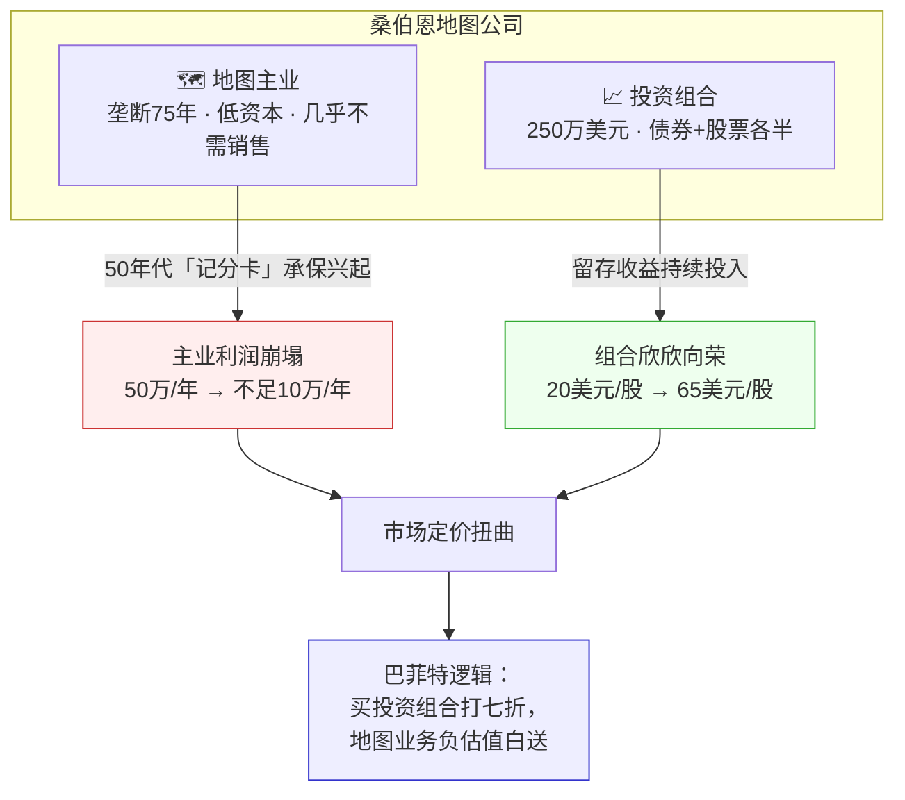
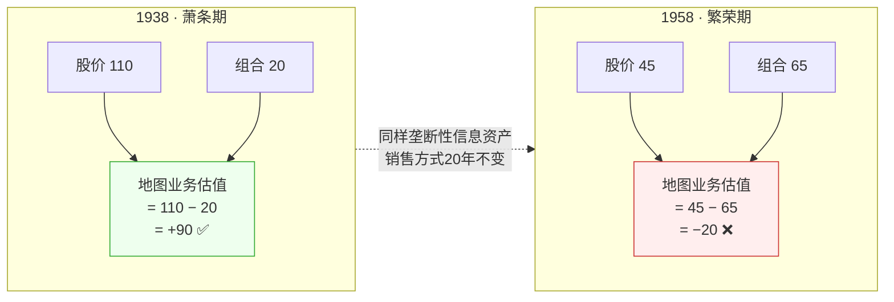
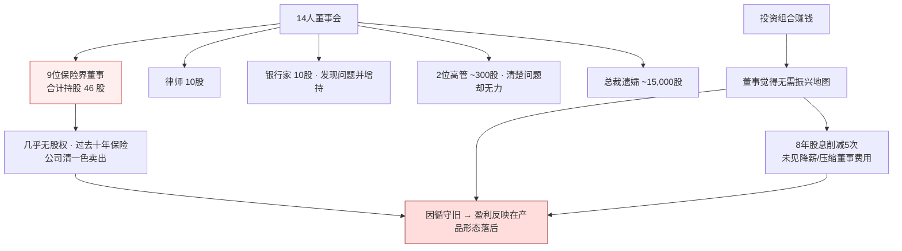
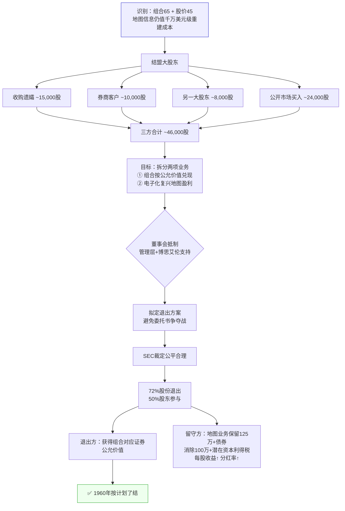
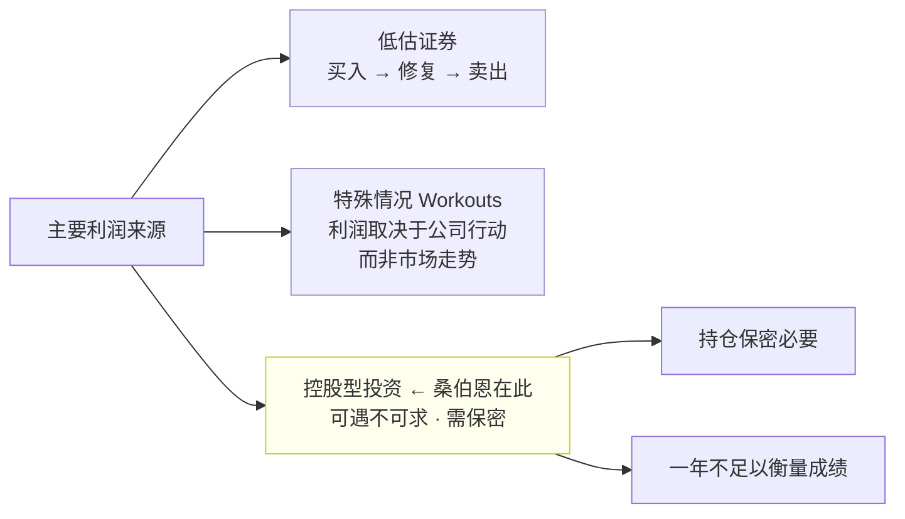
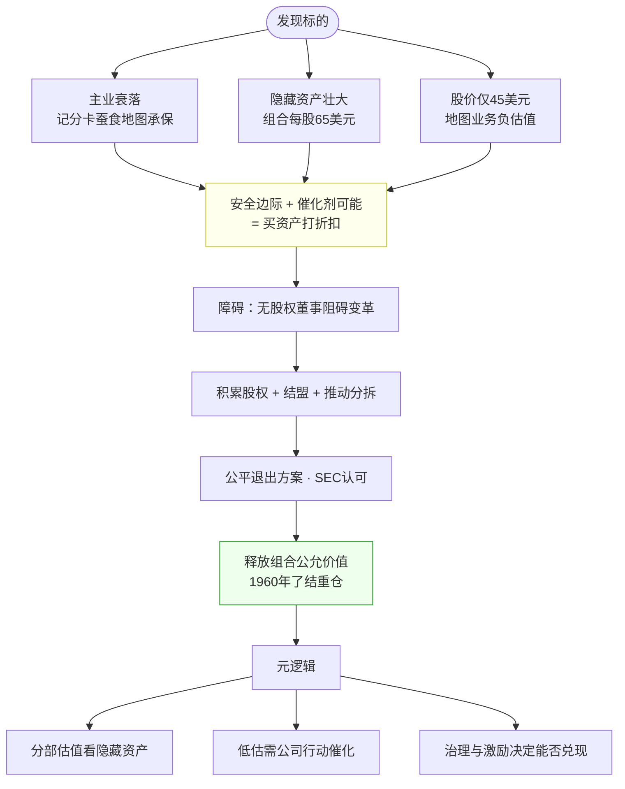

# 桑伯恩地图公司：巴菲特投资逻辑图谱

> 来源：1961年1月30日致合伙人信 · 1960年了结 · 占净资产约35%

---

## 1. 总览：双重业务与核心矛盾

---

## 2. 估值逻辑：1938 vs 1958

**读法：** 分拆估值（SOTP）——隐藏资产被烂主业拖累，出现「负估值」安全边际。

---

## 3. 治理失灵：谁在做决策？

---

## 4. 巴菲特行动链：从识别到了结

---

## 5. 投资类型定位（合伙基金策略谱系）

---

## 6. 一图串起来：巴菲特完整推理链

---

## 关键数字速查

| 项目 | 数值 |
|------|------|
| 基金仓位占比 | ~35% 净资产 |
| 1938 股价 / 组合 | 110 / 20 → 地图估值 +90 |
| 1958 股价 / 组合 | 45 / 65 → 地图估值 −20 |
| 地图业务利润（30年代 vs 1958-59） | 50万+ / 不足10万 |
| 仍有「地图」承保的火险保费 | 逾5亿美元 |
| 结盟后合计持股 | ~46,000 股 |
| 退出方案参与比例 | 72% 股份 · 50% 股东 |
